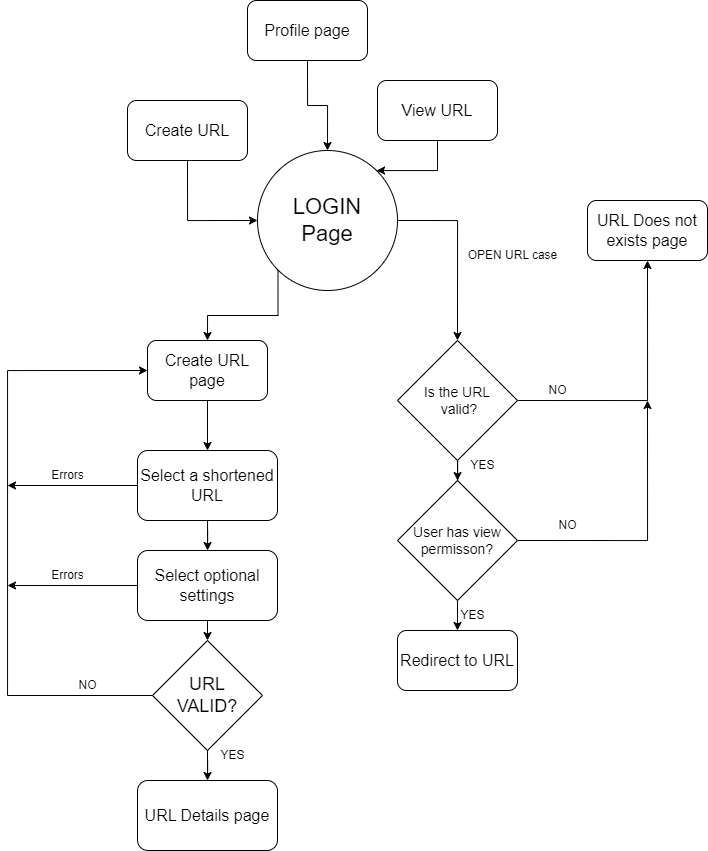

**Personal Information**
=====================
- Name: Apoorv Pandey   
- Email: apoorvpandey0@gmail.com
- Github: [ApoorvPandey0](https://github.com/apoorvpandey0)
- Youtube: [Link](https://www.youtube.com/channel/UCqt-XHfPFjSZPV8WqWaTV8Q)
- Location: Bhopal, India
- Time Zone: UTC+530
- University: University Institute of technology RGPV, Bhopal
- Major: Information Technology

**Project Description**
=====================
- Name: [URL Shortener with a twist](https://ccextractor.org/public/gsoc/2022/urlshortener/)
- Mentor: [Undecided](#)
- Goal: Build a web based URL Shortener application which has features like simple email based authentication, Url opened notification, Ability to whitelist people based on email addresses. The application should be scalable and performant.

**About me**
=====================
I have expertise in building backend and mobile applications at scale, I have developed and am currently maintaining mobile applications with over 100,000+ downloads on Google play store [Kisan samadhan Play store link](https://play.google.com/store/apps/details?id=com.kisansamadhan.kisansamadhan&hl=en_IN&gl=US)

Apart from this also I have worked as a Freelancer and Youtube content creator in the past working on Flutter and Django for mobile and backend development. I have also interned at Bajaj Finserv Health (India's leading health tech startup) for 6 months.

**Features of the application**
=====================
 - **Shorten URL**: Create a shortned URL from a given original URL, this could be  automatically assigned or choosen by the user from available links generated based on users preferance
 - **Whitelist users** based on emails for each URL, This would be an optional feature for each shortned url
 - Simple **Email based authentication** when opening URL, to login simply goto your email and click a link sent by our system to login. The link will be valid for 5 minutes and will be usable only one time (For security reasons)
 - Send **email notification** when a user from our whitelist opens our URL, this would also be a optional feature to select while creating a shortned url
 - **Admin panel** to manage Users, Emails and Urls, this would be useful for performing admin tasks

**User flow diagram**
=====================
  

**Architecture**
=====================

### Frontend
Route  | Name | Description | 
------------- | ------------- | ------------- |
`/`| Home |Home page for our application containing project info and maybe some stats on how many url have we opened till now
`/<URL>`| Redirects to url | Redirect user to signin page if not signed in then checks if the url is valid and the current user has access to open it. If so then redirect to url page fetched from server and trigger `/urlOpened` api|
`/login`| Auth page | This is the auth page for our client application|
``| | |

### Backend
We will have the following API's:

Endpoint  | Name | Description | 
------------- | ------------- | ------------- |
`/sendEmail`  | Sends Email | Send email with auth link|
`/urlOpened` | sends mail | Sends url opened mail
`/login`  | Logs in user | Verifies auth code send via `/sendEmail` and returns a jwt token if correct |
`/checkURL` | Checks URLs | Checks if the user given url is available or not
`/createURL` | Creates URL in backend | Creates a shortened URL with all the features specified in json payload
`/profile` | User profile | Returns urls you have created with their basic details
`/getUrlDetails` | Gets all details of a url  | Fetches who viewed the particular url and other details like created date
`/openURL` | Checks and opens urls | If the given email has access to the url then redirect else say 404 url not found
`` |  |  |

 **Tech stack**
=====================
  ### 1. Backend - Django REST framework
  1. DRF is a modern API development framework which could be used to build applications at scale. 
  2. Django also provides an in built admin panel which works right out of the box for managing the backend.
  It could be used to create superadmins and staff users who can look after specific things if the go wrong somewhere.  
  3. We can use PostgreSQL (A performant and scalable MySQLbased database) as our database.
  4. This backend will be able to serve both mobile and web based frontends
  5. Swagger API documentation can be easily integrated with the Django backend providing neat and interactive docs for the API's apart from the written ones

  ### 2. Frontend web - React JS
  It is a popular frontend franework which wil work great with our usecase. It provides good tooling like router and http client which will help to manage the codebase.

  ### 3. Frontend mobile - Flutter 
 Could be done later on or could be included in this GSOC project as seen fit

**Timeline**
=====================

- May 4-28: Community bonding period
- **June week 1**: 
  1. Setting up backend and frontend codebases with PostrgeSQL configuration
  2. Integrating mail server with backend
  3. Creating home page for the app
- **June week 2**: 
  1. Creating and testing `/sendEmail ` and `/login` API's
     1. Send email will send out an email with a login link to the given email address, the token could be randomly generated and stored in the database temporarily while the user clicks it and logs in
     2. Login will first check if the user exists in our database, if so then it will return the existing user object to the frontend. If not then it will create a new user object and store it in the database
  2. Creating login page in frontend and integrating it with backend apis
- **June week 3**: 
  Create URL's related models and API's namely:
  1. `/createURL`
     1. Create model for URL's with user model as a foreign key
     2. Internally validate if the given shortned URL is valid and does not exists in our database
  2. `/checkURL`
     1. Takes in a user given shortened URL and returns `True` if the URL is available for use and `False` if it has already been taken by some other user
  3. `/getUrlDetails`
     1. Given a URL and auth token it will return URL details like if it is valid, expiry etc
  4. `/urlOpened`
     1. Will trigger an email to the creator of the url saying "X has opened your url"
- **June week 4**: 
- Create frontend pages namely:
  1. Create URL page
     1. URL availablity checker form
     2. Section for allowing authentication for viewing URL's
     3. Section for entering and saving Whitelisted email addresses
     4. Submit validation for the form
  2. URL does not exists page
     1. It will show URL does not exists in two cases: When either the URL is invalid, or the user is not present in the whitelisted users for that particular URL
  3. View URL page
     1. Will check URL validity and redirect if both the url is valid and the user has permissions
- **July week 1**:
  Integrate all UI elements and pages to backend API's 
  1. Integrate create URL page
     1. Integrate url availablity checker form which needs to call `/checkUrl` api repeatedly
     2. Submit all the data collected through the form to the `/createURL` api in a JSON predefined format
  2. Integrate view url page with backend api's: 
     1. Call url checker API to get if if the user has permissions to view the url and the url is valid. It true then redirect to the url after calling `urlOpened` else redirect to Url not found page.
- **July week 2**: 
1. Create user profile page
  1. The page will contain all the urls you have creates with option to edit or delete the urls
2. Create `/profile` API 
- **July week 3**: 
  1. Integrate the profile api to the profile page
  2. Improving test cases and testing project features for bugs
  3. Working on admin panel for easy management
  4. Integrate API documentation tools like Swagger for providing neat and interactive API's
- **July week 4**: 
  1. Using Nginx to serve the application
  2. Contanerizing the application for easy deployments  
  

**Conclusion**
=====================
I have presented a well rounded overview of the application I am proposing to develop in this Gsoc.
I have covered:
1. User flow
2. API development plan
3. Integration timeline with the UI
4. Admin level management and deployment of the application
As the project gets over by August I can also start working on a Flutter mobile app using the same API's for the next few months period.

Thank you!